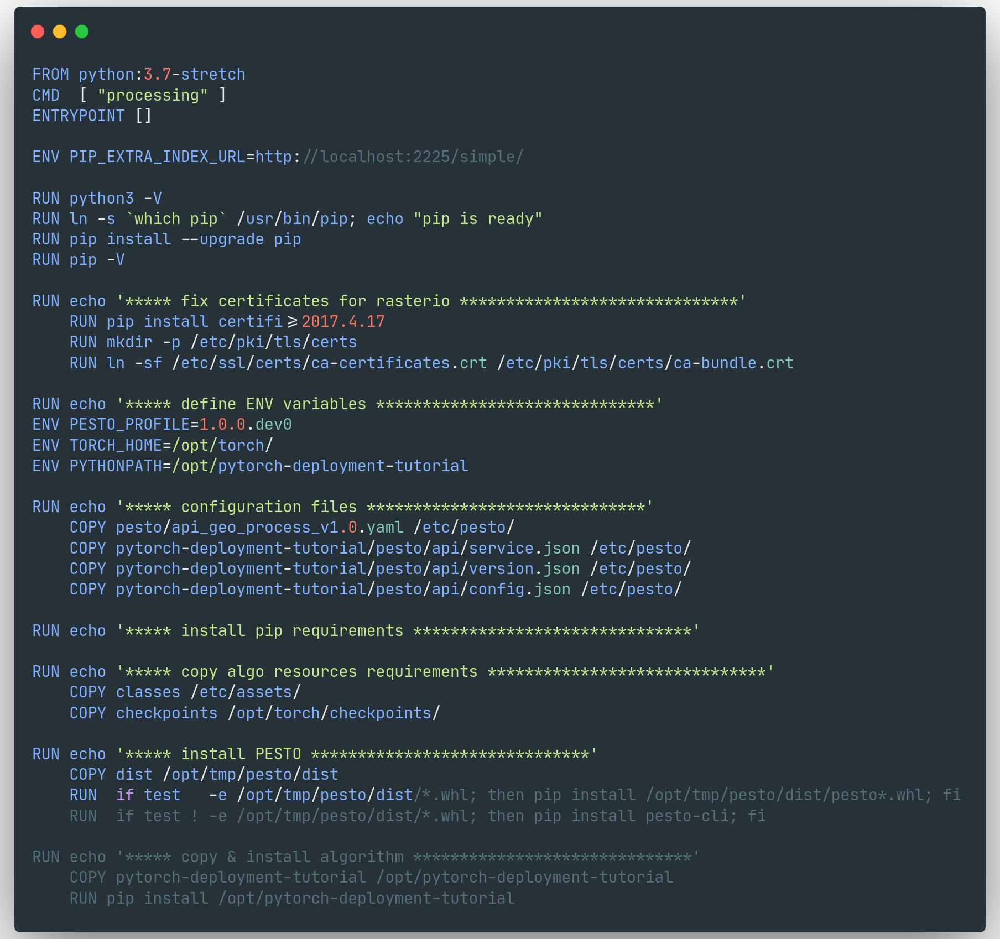

# Processing Factory Demo

<!--v-->

- https://github.com/fchouteau/processing-factory-demo/
- Example mirroring [Deploying PyTorch in Python via a REST API with Flask](https://pytorch.org/tutorials/intermediate/flask_rest_api_tutorial.html)
- Demo of building the pesto WS
- Demo of using the pesto WS

<!--v-->

https://github.com/AirbusDefenceAndSpace/pesto

```bash
git clone https://github.com/AirbusDefenceAndSpace/pesto
cd pesto && pip install .
```

(on pypi.org soon)

<!--v-->

Let's run pesto init


This will generate a python package template

<!--v-->


<!--v-->

here are the pesto build files


<!--v-->

We want a CNN that classifies image based on ImageNet.

Pesto wants a `algorithm.process.Process` class with a `process` method

The code looks like this...

<!--v-->


<!--v-->


<!--v-->


<!--v-->

Let's define our API:

- INPUT: An image
- OUTPUT: A json with the category as a string

<!--v-->

`pesto/api/input_schema.json`


<!--v-->

`pesto/api/output_schema.json`


<!--v-->

add a description

```json
{
  "title": "pytorch-deployment-tutorial",
  "name": "pytorch-deployment-tutorial",
  "version": "1.0.0.dev0",
  "description": "My first deployment with pesto",
  "family": "classification",
  "template": "image-classification",
  "keywords": [
    "classification",
    "resnet",
    "imagenet"
  ],
  "resources": {
    "cpu": 4,
    "gpu": 0,
    "ram": 8
  },
  "asynchronous": false,
  "organization": "Computer Vision",
  "email": "computervision@airbus.com",
  "licence": "Property of Computer Vision, all rights reserved"
}
```

<!--v-->

But what about our dependencies ?

let's look at requirements.json <!-- .element: class="fragment" data-fragment-index="1" -->

<!--v-->


<!--v-->

For custom depencies you can...

- use a custom docker images (custom deps, compiled code etc...) <!-- .element: class="fragment" data-fragment-index="1" -->
- specify .tar.gz archives for static files & python dependencies <!-- .element: class="fragment" data-fragment-index="2" -->
- specify requirements.txt for your package for pip dependencies <!-- .element: class="fragment" data-fragment-index="3" -->

<!--v-->

Now... let's build with `pesto build .`

This will parse the pesto folder and generate a folder with everything correctly placed + a dockerfile

<!--v-->


<!--v-->


<!--v-->



<!--v-->

Et voilà !


<!--v-->

Now... how do we use it ?

`docker run --rm -p 4000:8080 pytorch-deployment-tutorial:1.0.0.dev0`

Example request ...

`curl -X GET http://localhost:8080/api/v1/describe`

<!--v-->

But for a processing ? Using `requests` in python... or use the `pesto` API helpers

<!--v-->


<!--v-->

And why not build a frontend to use it ?

https://www.streamlit.io/

<!--v-->

<video data-autoplay src="static/streamlit.mp4"></video>

<!--v-->

Now that your service is tested... you can pass it to production, deploy it on a K8s cluster...

<!--v-->

The end !